# Taproot Assets Playground

This Taproot Assets Playground provides a docker stack that comprises of multple integrated litd nodes, connected together on a local regtest network.

You can use this to get familiar with [Taproot Assets](https://docs.lightning.engineering/the-lightning-network/taproot-assets).

## Setup

**Clone the repository and submodules:**

```sh
git clone --recursive https://github.com/LN-Zap/taproot-assets-playground.git
```

**Initialise the network:**

Run the following command to initialise the nodes:

```sh
./scripts/init.sh
```

This script sets up a dockerized network of lightning nodes, funds the nodes, and creates channels between them, mints taproot assets.

**OR start an already initialised network:**

Run the following command to startup the nodes:

```sh
docker compose up
```

### Nodes

The script currently sets up two nodes:

- `litd1`: This is an instance of litd, it serves an asset universe with a single asset.
- `litd2`: This is another instance of litd that connects to `litd1` and subscribes to the asset universe.

### Channels

The script sets up the following channels, which allows for testing of Bolt 12 interoperability between different Lightning Network node implementations and various channel configurations:

```mermaid
graph LR
    classDef nodes stroke:#FFD4D4,stroke-width:1px,fill:#303030;
    classDef groups stroke:#grey,stroke-width:1px,fill:none

    subgraph litdgroup ["regtest network"]
        litd1(litd1)
        litd2(litd2)
    end

    subgraph taprootgroup ["taproot assets federation"]
        taproot(Taproot Assets Universe)
        strikeusdt(L-USDT asset)
    end

    litd1 -- 10M channel to --> litd2
    litd1 --serves--> taproot
    litd2 -- connects to --> taproot
    litd1 -- mints --> strikeusdt
    taproot -- contains --> strikeusdt

    class litdgroup,taprootgroup groups;
    class litd1,litd2,taproot,strikeusdt nodes;
```




## Using CLI Commands

You can interact with any of the nodes using CLI commands. The bin scripts provided in the repository allow you to issue commands against any of the nodes. the bin scripts are:

- `bin/bitcoin-cli`: This is the bin script for bitcoin-cli.
- `bin/litcli`: This is the bin script for the lit cli.
- `bin/lncli`: This is the bin script for the lnd cli.
- `bin/tapcli`: This is the bin script for the tapd cli.

To use the CLI commands, you need to pass the node name as the first argument to the relevant bin script. The node names are:

- `litd1`
- `litd2`

Here's an example of how to use the CLI commands:

```sh
./bin/lncli litd1 getinfo
```

In this example, `./bin/lncli` is the bin script for the lnd-cli, `litd1` is the name of the node you're issuing the command against, and `getinfo` is the command you're issuing. This command retrieves information about the `litd1` node.

You can replace `getinfo` with any other command supported by the node. For a list of available commands, you can use the `help` command. For example:

```sh
./bin/tapcli litd2 help
```

This command displays a list of all tapcli commands that you can issue against the `litd2` node.

## Clean up

This will remove all docker container, images, and volumes created by this project.

**Clean everything:**
```sh
./scripts/clean.sh
```

## Resources

Some useful resources to get started with Taproot Assets:

- https://docs.lightning.engineering/lightning-network-tools/taproot-assets/rfq
- https://github.com/lightninglabs/taproot-assets/blob/main/docs/examples/basic-price-oracle/main.go
- https://lightning.engineering/api-docs/api/taproot-assets/index.html
- https://gist.github.com/MegalithicBTC/8b1a0ce0084e951e39bc54c3eccca89c#file-how-do-i-know-if-i-have-all-the-binaries-installed
- https://docs.lightning.engineering/lightning-network-tools/taproot-assets/taproot-assets-channels

